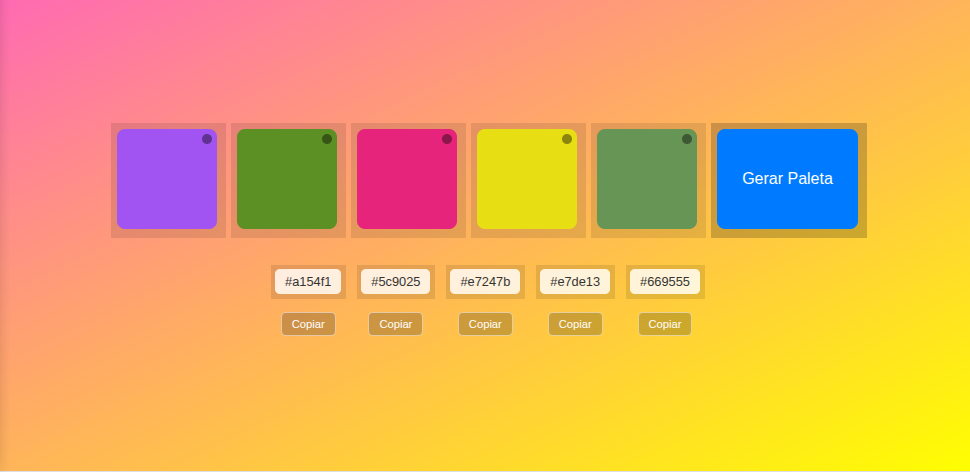

# Gerador de Paleta de Cores

## Sobre o Projeto

Este é um gerador de paleta de cores interativo, construído como um projeto de portfólio para demonstrar habilidades em design de produto (UI/UX) e desenvolvimento front-end. O projeto permite que o usuário gere paletas de cores aleatórias, copie os códigos hexadecimais e trave cores específicas que ele gostou.

## Funcionalidades

- **Gerador de Cores:** Clique em "Gerar Paleta" para criar 5 cores aleatórias.
- **Copiar para a Área de Transferência:** Clique no botão "Copiar" para salvar o código da cor.
- **Travar Cor:** Clique no ícone de cadeado para bloquear uma cor. A cor travada não mudará na próxima geração.

## Tecnologias

- **HTML5:** Estrutura do projeto.
- **CSS3:** Estilização, layout e gradientes.
- **JavaScript:** Lógica de geração de cores, manipulação do DOM e funcionalidades de copiar e travar.

## Como Usar

Para usar este gerador, basta abrir o arquivo `index.html` em qualquer navegador.
